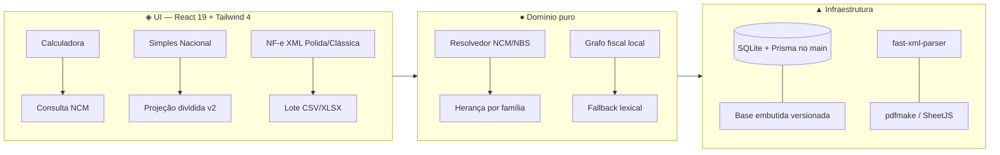

<div align="center">

<!-- ═══════════════════════════════════════════════════════════ -->
<!--  ◆  AURUM TAX NCM  ◆  Reforma Tributária — LC 214/2025  ◆  -->
<!-- ═══════════════════════════════════════════════════════════ -->

# ◆ Aurum Tax NCM ◆

### Classificador fiscal da Reforma Tributária — LC 214/2025

**Analise XML · Classifique por NCM / NBS / CNAE · Simule IBS / CBS e Simples · Gere relatórios**

<br/>

[](./electron/main.ts)
[](./src/App.tsx)
[](./vite.config.ts)
[](./tsconfig.json)
[](./src/index.css)
[](./LICENSE)

<br/>

> **Aplicativo desktop (Windows / macOS / Linux) + modo web · 100% local · offline-first · sem backend.**

◈ ━━━━━━━━━━━━━━━━━━━━━━━━━━━━━━━━━━━━━━ ◈

**Versão `1.0.0` · `10` views · `161` suítes Vitest · `1.798` casos · `typecheck` limpo**

*Estado auditado em **08/10/2026** a partir da árvore de trabalho (branch `main`).*

[◈ Estado atual](#-estado-atual--auditado-em-08102026) · [✨ Recursos](#-recursos-por-módulo) · [🚀 Começo rápido](#-começo-rápido) · [📖 Guia de uso](#-guia-de-uso--módulo-a-módulo) · [🧮 Regras de cálculo](#-como-o-cálculo-funciona) · [🛠️ Desenvolvimento](#️-desenvolvimento)

</div>

---

## ◈ Estado atual — auditado em 08/10/2026

> Este README descreve somente o que existe hoje na árvore.

### ● Painel de saúde

| Sinal | Valor real (árvore de trabalho) |
|---|---|
| 🖥️ Views no menu | **10** — Calculadora · Simples Nacional · Consulta NCM · Serviços (NBS) · Consulta de CNAEs · Classificação em lote · Notas Fiscais (XML) · Produtos · Tabelas auxiliares · Legislação |
| 🧪 Testes | **161 arquivos** · **1.798 casos** — `npm test` → **tudo passando** · `npm run typecheck` limpo |
| ✅ Tipos | `npm run typecheck` (`tsc --noEmit`) — **limpo** |
| 📦 Instaladores locais | `release/` com `Setup 1.0.0` + `Portátil 1.0.0` (ignorado no git, gerado por `npm run dist:win`) |
| 🗄️ Base embutida | `public/base/` versionada: `reforma.json` 1,5 MB · `nomenclatura.json` 2,8 MB · `classificacoes-consolidadas.json` 1,7 MB · `cnae-nbs.json` 1,3 MB · grafo `grafo.lbug` 6,1 MB · `vetores.json` 12 MB |
| 📥 Formatos de entrada | **XML de NF-e/NFC-e** (modelo 55/65) + **CSV/XLSX de lote** (`COD/SKU; NOME; NCM; CFOP; CST; PIS; COFINS`) |

### ◆ Arquitetura em uma figura



---

## ✨ Recursos por módulo

| Módulo | O que faz (hoje) |
|---|---|
| 🧮 **Calculadora** | Cesta com produtos salvos ou NCM manual, qtd/valor editáveis, base + IBS + CBS + total + carga efetiva em tempo real. Alíquotas de referência editáveis (padrão IBS 19% + CBS 9%). Redução congelada no momento da adição |
| 🧾 **Simples Nacional** | Passo 1: Anexo manual **ou** CNPJ → 1 CNAE (“Qual usar?”). Passo 2: RBT12 + receita (+ folha se Anexo V/Fator R + RBA opcional + comparador híbrido opcional). Passo 3: cálculo com skeleton → slide-in. Saída: DAS + repartição por tributo + trava ISS 5% + Fator R + sublimite em 4 cenários + duelo Conv × Híb + **Relatório Analítico e Inteligente** (10 cenários, matriz III×V em CNPJ dual, memória do híbrido, gap de folha) + exports CSV/JSON/PDF premium |
| ✂️ **Projeção dividida v2** *(dentro do Simples, só via CNPJ)* | Wizard em **5 etapas** (RTB12 → receita → divisão → custos & Fator R → resultado). Receita 12 meses ou global, slider 0–100%, anexos/folhas/custo mensal + abertura única + pró-labore (INSS/IRPF), segregação por anexo, recálculo ao vivo (faixa, alíquota efetiva, DAS unificado × dividido, economia líquida, virada, payback, veredito), gráficos + tabela mensal + exports CSV/JSON + persistência por CNPJ/período em `localStorage` |
| 🔍 **Consulta NCM** | 8 dígitos (com/sem ponto), fan-out número/nome/busca local, N cards (CST · cClassTrib, % redução, anexo oficial, base legal, documentos), observações legais automáticas (arts. 127/128/135/137/158/261/275–289/308), **herança por família** (SH6 ≥ 60%, SH4 ≥ 75%, capítulo ≥ 95%) com carimbo de confiança, **2ª opção de diferimento** no Anexo IX condicional (CST 515, 0%), simulador editável, deep-link na legislação |
| 🧰 **Serviços (NBS) + CNAEs** | NBS manual (9 dígitos) + descrição livre + CNPJ → CNAEs → NBS. Base viva (1.090 CNAEs + 122 vínculos NBS), resolvedor próprio (regra geral `000/000001` fora da base), busca textual, ponte CNAE→NBS, `CartaoCnae`/`FaixaCnae`, trilha de auditoria. Tela dedicada **Consulta de CNAEs** com regra do Simples + benefício da Reforma |
| 📁 **Classificação em lote** | CSV/XLSX (`COD/SKU; NOME; NCM; CFOP; CST; PIS; COFINS`), pills (classificadas · regra geral · múltiplas opções · inválidos), `<select>` por linha, revisão determinística, salvamento idempotente como produtos, modelo CSV para download |
| 🧾 **NF-e XML (2 layouts)** | `NfeXmlPolida` (padrão: veredito → ação → 5 abas, zero canvas, count-up, `localStorage['xml-layout']`) + `NfeXml` clássica (Chart.js). Hero executivo, entradas × saídas, quarentena, ranking de fornecedores, top produtos/NCM/CFOP/CST, confronto Antigo × Novo, evolução mensal, apuração **assistida** (crédito **efetivo** do XML abate o saldo; estimativa via NCM é informativa), bloco **Naturezas da operação**, selo **CEST/ST** (1.010 registros, “sujeito a ST”), relatório + modal, XMLs arquivados em `%APPDATA%/Aurum Tax NCM/xml/<cnpj>/<chave>.xml` |
| 📦 **Produtos & 🏢 Empresas** | Multi-empresa (CNPJ, razão social, fantasia, lote), produtos vinculados à empresa ativa, filtro rápido, paginação, exports CSV/JSON/PDF, idempotência em importações repetidas |
| 📚 **Tabelas auxiliares** | 8 listas editáveis via `AUX_META`: CST IBS/CBS, cClassTrib, NCM vigente, vínculo NCM×Classificação, CFOP, CST ICMS, CST PIS/COFINS (+ CNAE). Criar/editar/excluir com validação |
| ⚖️ **Legislação** | LC 214/2025 + Decreto 12.955/2026 + Res. CGIBS 6/2026 + RICMS-CE + portais, leitura in-app via `ModalLegislacao`, deep-link `#art128` etc. |
| 🖨️ **Emitente timbrado** | Razão social, CNPJ, logo, cor, rodapé — cabeçalho de todos os PDFs + modal de preview |
| 🔄 **Atualização e bases** | GitHub Releases (Configurações → Atualização, com snapshot pré-update do banco). Bases embutidas renovadas a cada release. Complementos online: Siscomex + CFF + BrasilAPI (com fallback manual). Backup/restauração JSON das 27 tabelas (KEK e resumos fora por construção), idempotente, com validação prévia e snapshot pré-restore |
| 🌙 **UX** | Tema claro/escuro, responsivo, sidebar recolhível (desktop) / drawer (móvel), transições em carrossel com respeito a `prefers-reduced-motion`, toasts 3,4 s, skeleton/count-up, aceite local no primeiro uso, fundo global animado |

---

## 🚀 Começo rápido

### Requisitos

- **Node.js 20+** e **npm 10+** (só para desenvolver/compilar — o usuário final usa o instalador)
- Windows 10/11 64-bit, macOS 12+ ou Linux (desktop)
- ~1 GB livre para compilar · instalador Windows ~120 MB · **sem necessidade de administrador**

### 1 · Instalar

```bash
git clone https://github.com/Davidev29/aurum-tax-ncm.git
cd aurum-tax-ncm
npm install
```

### 2 · Rodar em desenvolvimento

```bash
# Web + Electron juntos (recomendado)
npm run dev

# Só web (navegador, sem Electron)
npm run dev:web

# Tipos + testes
npm run typecheck
npm test
```

> O `predev` mata a porta 5173, regenera a base (`npm run base`) e compila o main do Electron. Acesse **http://127.0.0.1:5173**.

### 3 · Gerar o instalador

```bash
npm run dist        # build completo + instalador da plataforma atual
npm run dist:win    # NSIS (.exe) + Portable
npm run dist:mac    # DMG + ZIP (x64 + arm64)
npm run dist:linux  # AppImage
```

Artefatos em `./release/` (ignorado no git):

| Arquivo | O quê |
|---|---|
| `AurumTaxNCM-Setup-<versão>-win-x64.exe` | Instalador NSIS (PT-BR, por usuário, atalho + desinstalador) |
| `AurumTaxNCM-Portatil-<versão>-win-x64.exe` | Versão portátil (sem instalar) |

O instalador leva **só o app**: interface + base tributária embutida + grafo fiscal + conhecimento curado. Fora do instalador: `.planning/`, `docs/`, `tests/`, `scripts/` e artefatos de build intermediários. A classificação roda 100% local e offline (léxico + sinônimos + grafo + resolvedor oficial). Dados do usuário (XMLs, SQLite `aurum.db`) vivem em `%APPDATA%` e sobrevivem a atualizações.

---

## 📖 Guia de uso — módulo a módulo

<details open>
<summary><b>🧮 1 · Calculadora</b></summary>

1. Abra **Calculadora** no menu lateral.
2. Busque um produto salvo (SKU, nome ou NCM) **ou** clique em **➕ NCM manual**.
3. Ajuste quantidade e valor unitário direto na lista.
4. O **Resumo do cálculo** atualiza sozinho: base · IBS (R$) · CBS (R$) · total · carga efetiva (%).
5. Altere as **alíquotas de referência** no card lateral se precisar — todo o sistema usa esses dois números.
6. **💾 Salvar no produto** grava o cálculo de volta no cadastro.

</details>

<details>
<summary><b>🧾 2 · Simples Nacional + projeção dividida v2</b></summary>

1. Vá em **Simples Nacional**.
2. **Passo 1:** Manual (Anexo I–V) ou Automático por CNPJ (Buscar atividades → escolha **1 CNAE**).
3. **Passo 2:** RBT12 + receita do mês (+ folha 12m se Anexo V/Fator R, RBA opcional, comparador híbrido opcional).
4. **Passo 3:** **✨ Visualizar cálculo** → DAS + repartição + Fator R + sublimite + duelo Conv × Híb + relatório analítico.
5. Ações: **Repartição** (modal DAS), **CSV / JSON / PDF**, **Limpar**.
6. **Só via CNPJ:** **✂️ Dividir faturamento** → wizard 5 etapas (RTB12 deslizante → receita → split 0–100% → custos/Fator R/pró-labore → resultado com virada, payback e veredito). Alterne **Empresa única ↔ Segregada**, passe o mouse nos meses para a memória de cálculo, exporte CSV/JSON.

</details>

<details>
<summary><b>🔍 3 · Consulta NCM</b></summary>

1. Vá em **Consulta NCM**, digite `02011000` ou `0201.10.00` (sugestões a partir de 2 dígitos; aceita nome do produto).
2. **Classificar** → descrição oficial + capítulo + um card por classificação (CST · cClassTrib, reduções, anexo oficial, base legal, documentos).
3. Leia as observações legais automáticas, ajuste o simulador, abra a **legislação no artigo exato**.
4. **➕ Adicionar à calculadora** joga a classificação na cesta.
5. Sem vínculo exato? O sistema tenta a **herança por família** com confiança e trilha; sem lastro, aplica a **regra geral** (`000 · 000001`) em âmbar. Anexo IX condicional mostra a **2ª opção de diferimento** (CST 515, 0%).

</details>

<details>
<summary><b>🧰 4 · Serviços (NBS) e CNAEs</b></summary>

1. **Serviços (NBS):** manual (NBS ou “aula de inglês online”) ou por CNPJ (lista CNAEs com anexo + elegibilidade, 1 cartão por CNAE). Cada resultado: CST/cClassTrib, reduções, anexo LC 214, base legal, simulação, trilha.
2. **Consulta de CNAEs:** CNAE → regra do Simples + NBS e benefício da Reforma (ref. anual).

</details>

<details>
<summary><b>📁 5 · Classificação em lote</b></summary>

1. Baixe o **modelo CSV** na primeira vez.
2. Arraste `.csv` / `.xlsx` / `.xls` para a área pontilhada.
3. Confira as pills, troque a classificação no `<select>` quando houver N opções.
4. **Salvar todos como produtos** (ignora linhas sem SKU/NCM válido, idempotente).

</details>

<details>
<summary><b>🧾 6 · Notas Fiscais (XML)</b></summary>

1. Selecione a empresa ativa, vá em **Notas Fiscais (XML)**.
2. Arraste 1 ou N `.xml` (NF-e 55 / NFC-e 65; duplicadas ignoradas, quarentena separada).
3. Hero executivo: **veredito** (A pagar / Saldo credor / Zerado) + base + IBS+CBS + carga + barra de cobertura.
4. Explore as 5 abas: **Notas** · **Fornecedores** · **Produtos** · **NCM** · **Insights**. Confira **Naturezas da operação** e o selo **CEST/ST** por item.
5. Vale o **crédito efetivo** do XML; estimativa via NCM é informativa com divergência. Ações: vincular produtos, filtros, relatório, alíquotas editáveis, alternância **Polida ↔ Clássica** (`xml-layout`).

</details>

<details>
<summary><b>📦 7 · Produtos, 🏢 Empresas, 📚 Auxiliares, ⚙️ Configurações</b></summary>

- **Produtos:** filtro SKU/nome/NCM, exports CSV/JSON/PDF, edite/exclua. Respeita a empresa ativa.
- **Empresas** (🏢 no header): cadastre por CNPJ, importe em lote, defina a ativa. Sem empresa = *modo visualização*.
- **Auxiliares:** 8 listas com filtro + **＋ Novo** + editar/excluir. Útil quando a legislação atualizar um código antes da próxima base oficial.
- **Configurações** (⚙️): emitente timbrado (+ preview), importação da base, backup/restauração JSON, status da base, **Atualização** via GitHub Releases.

</details>

---

## 🧮 Como o cálculo funciona

### IBS / CBS (LC 214 — redução de alíquota)

Fórmula única em Calculadora / Consulta / Lote / XML:

```text
aliqIBS = 19 × (1 − redIBS/100)
aliqCBS =  9 × (1 − redCBS/100)
vIBS    = base × aliqIBS / 100
vCBS    = base × aliqCBS / 100
total   = vIBS + vCBS
carga   = base > 0 ? total/base × 100 : 0
```

Derivação do **anexo operacional** por `redIBS + redCBS`:

| redIBS / redCBS | Anexo | Rótulo |
|---|---|---|
| 100% / 100% | `0` | 🟢 Alíquota zero |
| 80% | `80` | 🟠 Redução 80% (art. 158) |
| 70% | `70` | 🟠 Redução 70% (art. 261) |
| 60% / 60% | `60` | 🟡 Redução 60% (arts. 128/135/137) |
| 50% | `50` | 🔵 Redução 50% (art. 261) |
| 40% | `40` | 🔵 Redução 40% (arts. 275–289) |
| 30% | `30` | 🔵 Redução 30% (art. 127) |
| IBS ≠ CBS | `misto` | 🟣 IBS ≠ CBS (ex.: Prouni 60/100, art. 308) |
| 0% | `isento` | ⚪ Sem redução |

> Os cartões exibem o anexo **oficial** da base (`Número do Anexo`), nunca confundir com a faixa derivada acima.

### Simples Nacional (LC 123 + Reforma, vigência 2027–2028)

```text
faixa           = localizar(RBT12 nos limites do anexo)
aliquotaEfetiva = (RBT12 × nominal − deduzir) / RBT12
DAS             = aliquotaEfetiva × receitaMes
repartição      = DAS × %faixa por tributo
6ª faixa        = ICMS/ISS/IBS/IPI pela efetiva da 5ª faixa
ISS             = trava 5% + redistribuição (IRPJ/CSLL/CBS/CPP)
sublimite 3,6M  = 4 cenários (RBT12 × RBA)
Fator R         = folha12 / RBT12 (≥ 28% → III, senão V)
híbrido         = DASreduzido = DAS − CBSdentro; CBSfora = MAX(0, débitos − créditos)
projeção        = RBT12(t) = Σ R[m], m ∈ [t−12, t−1]; nova < 12m usa média × 12
```

---

## 🛠️ Desenvolvimento

### Scripts npm

| Script | O que faz |
|---|---|
| `npm run dev` | Vite (127.0.0.1:5173) + Electron lado a lado |
| `npm run dev:web` | Só Vite no navegador |
| `npm run build` | `base` + `tsc` + Vite + Electron + ofuscar + verificar |
| `npm run base` / `base:completa` | Gera a base embutida (+ índice lexical, validação do conhecimento) |
| `npm run grafo:rebuild` / `grafo:avaliar` | Reconstrói o grafo fiscal (`scripts/build-grafo.mjs --forcar`) / avalia o recall do grafo |
| `npm run ia:indice` / `ia:testar-indice` / `ia:validar-conhecimento` / `ia:cobertura` | Pipeline de busca local (índice lexical, teste top-k, curadoria, cobertura PT↔EN) |
| `npm run ofuscar` / `verificar` | Ofusca o build / valida o build |
| `npm run typecheck` / `npm test` | Tipos / Vitest (`vitest run`) |
| `npm run db:generate` / `db:push` | Regenera o client Prisma + DDL embarcado (após editar `prisma/schema.prisma`) / aplica o schema no banco de dev |
| `npm run dist` / `dist:win` / `dist:mac` | Instaladores via electron-builder |
| `npm run icon` | Gera `build/icon.ico` a partir do SVG |

### Estrutura (poda atual)

```text
aurum-tax-ncm/
├── electron/            # main.ts, preload.ts, esbuild.mjs
│   ├── dist/            # compilados (main.js, preload.cjs)
│   └── ia/              # grafo fiscal local (grafo-service.cjs + caminhos-ia.cjs)
├── src/
│   ├── App.tsx          # shell com 10 views
│   ├── pages/           # 14 arquivos para 10 views: Calculadora, Consulta, ConsultaServicos,
│   │                    #  ConsultaCnaes, Lote, NfeXml, NfeXmlPolida (+ NfeNatureza,
│   │                    #  NfePendentes, NfeCalendarioAnual, ModalRelatorioNfe), Produtos, Auxiliares, Legislacao
│   ├── simples/         # módulo Simples isolado (tabelas, calculo, store, page,
│   │                    #  DasModal, relatorio-analitico, exports, ia-insights)
│   ├── simples-projection/ # projeção dividida v2 (camada aditiva sobre simples/):
│   │                    #  motor puro (janela-rbt12, cenario-dividido, baseline,
│   │                    #  das-segregado, simular-segregacao, fator-r-dividido,
│   │                    #  analise-retorno, pro-labore, persistencia) + UI
│   │                    #  (store, ModalDivisao, SimuladorSegregacao, ControleSplit,
│   │                    #  ResultadoDividido, NumeroAnimado, export, ferramentas)
│   ├── domain/          # entidades, constants, capitulos, legislacao, seeds
│   │   └── services/    # cálculo, classificação NCM/NBS, busca-texto, CNAE/CNPJ,
│   │                    #  CEST, hierarquia fiscal, vocabulários, preditivo…
│   ├── application/     # casos de uso (produtos, empresas, lote, backup, CFF/Siscomex,
│   │                    #  NFe insights/relatório/apuração, Simples, reclassificação,
│   │                    #  assistente por templates aurum-ai-*.ts)
│   ├── infrastructure/  # SQLite/Prisma, base, parsers (lote/NFe), CFOP/curadoria, PDF/CSV,
│   │                    #  CFF/Siscomex/BrasilAPI, bridge IPC
│   ├── store/           # Zustand (ui com 10 ViewId, sessão, calculadora, consulta,
│   │                    #  lote, nfe, produtos, base, ia (só observabilidade), dialogo, fundo, novidades…)
│   ├── ui/              # Layout, kit, Marca, ModalLegislacao, motion,
│   │                    #  consulta-enxuta/premium, servicos, cartoes, cest,
│   │                    #  diferimento-opcoes, grafo-trilha, aurum-ai (selos/UI)…
│   └── modais/          # globais (empresas/config/emitente/backup…), pagina
├── recursos-ia/         # busca local: índice lexical + conhecimento curado + grafo
├── bases-fonte/         # JSONs-fonte oficiais + vivos (ver tabela abaixo)
├── scripts/             # build-base, build-grafo, gerar-indice-ia (lexical),
│                        #  cobertura, ofuscar, verificar, after-pack…
├── tests/               # 161 suítes · 1.798 casos (tudo passando)
├── docs/                # SPEC, arquitetura, diagnósticos, manuais (.docx fora do installer)
├── public/base/         # base JSON embutida versionada + MANIFEST + grafo
├── build/               # icon.ico/png, LICENCA.rtf/txt (NSIS PT-BR)
└── release/             # instaladores gerados (ignorado no git)
```

Arquitetura: **React + Clean Architecture** — `domain` (regras puras) → `application` (casos de uso) → `infrastructure` (SQLite/Prisma, parsers, PDF) → `pages/ui` (apresentação). Paridade com a v1 documentada em [`docs/SPEC-LOGICA-NEGOCIO.md`](./docs/SPEC-LOGICA-NEGOCIO.md). `src/simples/` segue **isolado de propósito** (matemática própria das planilhas, sem importar o motor IBS/CBS); `src/simples-projection/` é **aditivo** (nunca toca `simples/`).

### Stack

- **Desktop:** Electron 44 + electron-builder (NSIS PT-BR, DMG, AppImage)
- **Front:** React 19, Vite 8 (`base: './'` p/ file://), TailwindCSS 4, Zustand 5, Framer Motion, Chart.js
- **Dados:** SQLite via Prisma 6 — 27 tabelas em `aurum.db` (`%APPDATA%`), Prisma no processo main + IPC, validação de domínio em toda escrita, seed transacional por lote, snapshot pré-restore, `integrity_check` + quarentena no boot. XLSX (SheetJS), pdfmake, fast-xml-parser
- **Busca local:** léxico + sinônimos curados + dicionário comercial + grafo fiscal local (FTS + 2-hops + PageRank, com fallback lexical idêntico) + resolvedor oficial como única verdade. O assistente Aurum AI responde por templates validados — todo número exibido vem do motor (IBS/CBS, DAS, RBT12)
- **Qualidade:** TypeScript strict, Vitest + SQLite/Prisma (banco por arquivo), esbuild, ofuscação + verificação de build

### Dados / base tributária

- `public/base/` carrega a base embutida gerada por `npm run base` (NCM × CST × cClassTrib + nomenclatura vigente + NBS + CNAE + `MANIFEST.json`).
- Para atualizar: **Configurações → Importação da base** (`NCM + tabelasAuxiliares` ou `Nomenclaturas`). Só entram vínculos com NCM de 8 dígitos; o resto é descartado com aviso.
- Backup: **Configurações → Backup** exporta o banco (27 tabelas + emitente) em JSON; restauração idempotente com validação prévia e snapshot pré-restore.

### Onde baixar as bases oficiais

Coloque os arquivos em `bases-fonte/` com os nomes exatos e rode `npm run base` (detalhes em [`bases-fonte/README.md`](./bases-fonte/README.md)):

| Arquivo em `bases-fonte/` | O que é | Onde baixar | Obrigatório? |
|---|---|---|---|
| `classificacao_tributaria.json` | Referência CST × cClassTrib (164 registros) | Portal DFe / Conformidade Fácil: https://dfe-portal.svrs.rs.gov.br/Cff → Classificação Tributária; API: `https://cff.svrs.rs.gov.br/api/v1/consultas/classTrib` | Sim |
| `reforma_tributaria_por_ncm.json` | Vínculos NCM/NBS × CST × cClassTrib | Mesmo portal CFF acima (exportação NCM da Reforma — LC 214/2025) | Sim |
| `Tabela_NCM_Vigente_AAAA-MM-DD.json` | Nomenclatura NCM vigente (~15 mil itens) | Portal Único Siscomex: https://portalunico.siscomex.gov.br/classif/api/publico/nomenclatura/download/json | Sim |
| `CNAE X ANEXO.json` | CNAE × Anexo Simples + Fator R (~1.090 CNAEs) | Arquivo vivo do projeto (sem URL oficial única) | Não (sem ele a store `cnae` nasce vazia) |
| `NBS SERVIÇOS.json` | Vínculos NBS (122 após dedupe + Anexo IX) | Arquivo vivo do projeto | Não |
| `CNAE X NBS.qualclasstrib.json` | Ponte CNAE → NBS (fonte não-oficial, só candidatos; verdade fiscal é o resolvedor) | Arquivo vivo do projeto | Não (sem ele a ponte CNAE→NBS fica vazia) |

---

## ❓ FAQ

**Precisa de internet?**
Não para o uso diário. Só legislação externa, sync Siscomex/CFF/BrasilAPI e verificação de atualização usam rede — tudo com fallback offline/manual.

**Meus dados saem da máquina?**
Não. Todo o processamento é local (SQLite no processo main do Electron). Não há backend, não há telemetria, nada é enviado para nuvem. As únicas chamadas de rede são opt-in com fallback manual: legislação externa, sync Siscomex/CFF/BrasilAPI e verificação de atualização.

**E se meu NCM tiver 2 classificações?**
Na Consulta você vê os N cards; no Lote você escolhe no select. No XML o sistema usa a primeira da base — troque manualmente no Lote se precisar. Itens do Anexo IX condicional mostram ainda a **2ª opção de diferimento** (CST 515, 0%) por operação.

**Posso usar no navegador sem instalar?**
Sim: `npm run dev:web` ou sirva `dist/` após `npm run build`. O Electron adiciona janela nativa, menu e instalador.

**Onde ficam meus XMLs e meu banco?**
XMLs em `%APPDATA%/Aurum Tax NCM/xml/<cnpj>/<chave>.xml`; banco (empresas, produtos, auxiliares) no SQLite local (`aurum.db`). Nada se perde ao atualizar.

**Como recebo tabelas novas?**
Junto com a atualização do programa (**Configurações → Atualização**). Como complemento, o app sincroniza a tabela Siscomex e as tabelas CFF quando há internet (alguns endpoints CFF exigem certificado ICP-Brasil — baixe o JSON no portal e importe manualmente).

**O Simples substitui a Calculadora IBS/CBS?**
Não. São motores separados: **Calculadora** simula IBS/CBS por NCM; **Simples** calcula o DAS (LC 123 + Reforma 2027–2028) e projeta divisão/segregação. Use os dois conforme o regime do cliente.

---

## ◈ Dívidas e próximos passos honestos

- [ ] Alinhar `package.json` (`UNLICENSED` + `private`) com o `LICENSE` MIT — decidir se publica ou mantém interno

---

## 📄 Licença

Ver [LICENSE](./LICENSE) (MIT — copyright Francisco Davi Carneiro Brito, 2026).

> Nota: `package.json` declara `private: true` + `UNLICENSED` (não publicado no npm). Vale o texto do arquivo `LICENSE` para o código-fonte.

Base legal: [LC 214/2025](https://www.planalto.gov.br/ccivil_03/leis/lcp/lcp214.htm) · [Decreto 12.955/2026](https://www.planalto.gov.br/ccivil_03/_ato2023-2026/2026/decreto/d12955.htm) · [Res. CGIBS nº 6/2026](https://www.cgibs.gov.br/upload/arquivos/202604/30084927-res-cgibs-n-6-30-abr-2026-regulamenta-o-ibs.pdf)

<div align="center">

◈ ━━━━━━━━━━━━━━━━━━━━━━━━━━━━━━━━━━━━━━ ◈

<sub>Feito com ⚖️ + 💻 para a transição tributária brasileira · <b>Aurum Bit Labs & Studios LTDA</b></sub>

</div>
